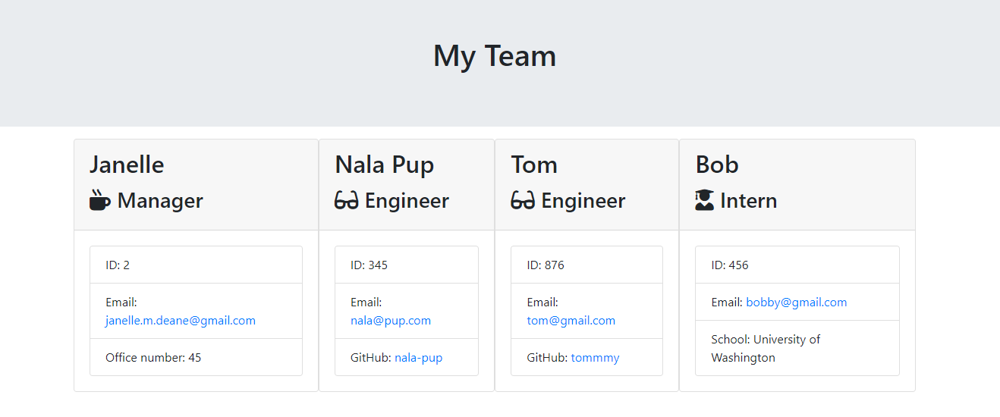
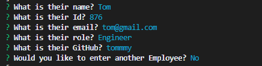

# Team Profile Generator
  
   ## Table of Contents: 
   
* [Description](#Description)

* [Installation](#Installation)

* [Usage](#Usage)

* [License](#License)

* [Contributors](#Contributors)

* [Tests](#Tests)

* [Questions](#Questions)

   ## Description: 
   Are you looking to create a team profile? Well look no further! We have made the process easy for you with this command line interface app! All you have to answer questions about your team and we automatically generate the HTML page for you! You can put your managers, engineers and interns all in one place. 
   ## Installation: 

   Installation Instructions

   Install- npm install
   ## Usage: 

   Usage Information 

   First open the folders and install the listed dependencies. Then run node app.js to generate your questions (see example below). Enter as many employees as your team has and when you are done, just select No” when asked if you would like to enter more employees. See below for what the HTML produces.  Used in this app are the following technologies: JavaScript, NPM, Node.js, Jest, Inquirer.js, CSS &HTML. 
    
    Sample Generated HTML Page
    
    
    
    Sample Questions 

    
  
    Video of Readme Generator in Action
    
    

   ## License
   
   
   ## Contributors: 

   Contribution Guidelines

   @Janelle-deane
   ## Tests: 

   Test Instructions

   npm run test
   ## Questions: 
   Feel free to reach out to me either on my github or email. 
   
   Github:
   https://github.com/janelle-deane/
   
   Email:
   janelle.m.deane@gmail.com